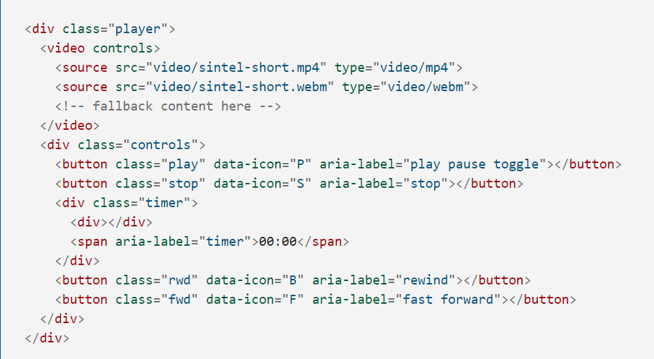
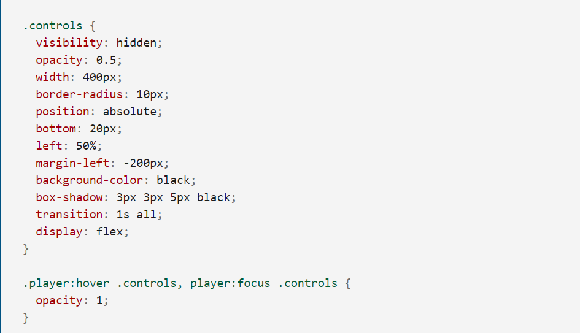
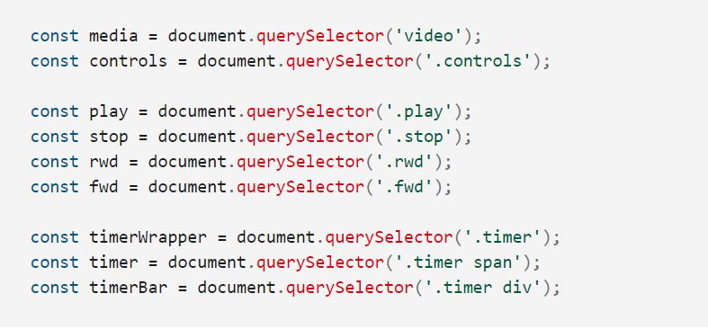
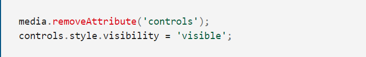

# Video and Audio APIs
#### HTML5 comes with elements for embedding rich media in documents — video and audio — which in turn come with their own APIs for controlling playback, seeking, etc. This article shows you how to do common tasks such as creating custom playback controls.
# The HTMLMediaElement API
#### Part of the HTML5 spec, the HTMLMediaElement API provides features to allow you to control video and audio players programmatically — for example HTMLMediaElement.play(), HTMLMediaElement.pause(), etc. This interface is available to both audio and video elements, as the features you'll want to implement are nearly identical. Let's go through an example, adding features as we go.
## Getting started
#### At this point, if you load the HTML you should see a perfectly normal HTML5 video player, with the native controls rendered.
## Exploring the HTML
#### Open the HTML index file. You'll see a number of features; the HTML is dominated by the video player and its controls:

## Exploring the CSS
#### Now open the CSS file and have a look inside. The CSS for the example is not too complicated, but we'll highlight the most interesting bits here. First of all, notice the .controls styling:

1. We start off with the visibility of the custom controls set to hidden. In our JavaScript later on, we will set the controls to visible, and remove the controls attribute from the video element. This is so that, if the JavaScript doesn't load for some reason, users can still use the video with the native controls.
2. We give the controls an opacity of 0.5 by default, so that they are less distracting when you are trying to watch the video. Only when you are hovering/focusing over the player do the controls appear at full opacity.
3. We lay out the buttons inside the control bar using Flexbox (display: flex), to make things easier.

## Implementing the JavaScript
#### We've got a fairly complete HTML and CSS interface already; now we just need to wire up all the buttons to get the controls working.
1. Create a new JavaScript file in the same directory level as your index.html file. Call it custom-player.js
2. At the top of this file, insert the following code:

3. Next, insert the following at the bottom of your code:

