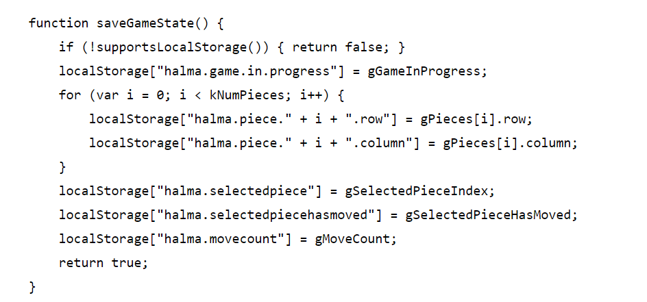

# EASILY CREATE STUNNING ANIMATED CHARTS WITH CHART.JS
#### Charts are far better for displaying data visually than tables and have the added benefit that no one is ever going to press-gang them into use as a layout tool. They’re easier to look at and convey data quickly, but they’re not always easy to create.

#### A great way to get started with charts is with Chart.js, a JavaScript plugin that uses HTML5’s canvas element to draw the graph onto the page. It’s a well documented plugin that makes using all kinds of bar charts, line charts, pie charts and more, incredibly easy.

#### To see how to use chart.js we’re going to create a set of 3 graphs; one will show the number of buyers a fictional product has over the course of 6 months, this will be a line chart; the second will show which countries the customers come from, this will be the pie chart; finally we’ll use a bar chart to show profit over the period.
## Setting up
#### The first thing we need to do is download Chart.js. Copy the Chart.min.js out of the unzipped folder and into the directory you’ll be working in. Then create a new html page and import the script:

## Drawing a line chart
#### To draw a line chart, the first thing we need to do is create a canvas element in our HTML in which Chart.js can draw our chart. So add this to the body of our HTML page:

#### Next, we need to write a script that will retrieve the context of the canvas, so add this to the foot of your body element:

#### (We can actually pass some options to the chart via the Line method, but we’re going to stick to the data for now to keep it simple.)

# Chart.js
## Creating a Chart
#### It's easy to get started with Chart.js. All that's required is the script included in your page along with a single canvas node to render the chart.
## Contributing
#### Before submitting an issue or a pull request to the project, please take a moment to look over the contributing guidelines first. For support using [chart.js](Chart.js), please post questions with the chartjs tag on Stack Overflow .

# License
#### Chart.js is available under the MIT license .
