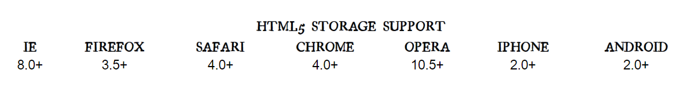
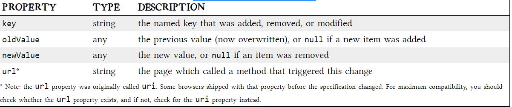
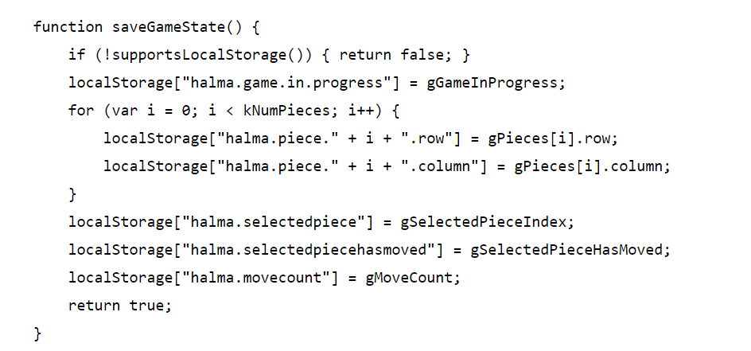

# THE PAST, PRESENT & FUTURE OF LOCAL STORAGE FOR WEB APPLICATIONS
## DIVING IN
#### ersistent local storage is one of the areas where native client applications have held an advantage over web applications. For native applications, the operating system typically provides an abstraction layer for storing and retrieving application-specific data like preferences or runtime state. These values may be stored in the registry, INI files, XML files, or some other place according to platform convention. If your native client application needs local storage beyond key/value pairs, you can embed your own database, invent your own file format, or any number of other solutions.
#### Historically, web applications have had none of these luxuries. Cookies were invented early in the web’s history, and indeed they can be used for persistent local storage of small amounts of data. But they have three potentially dealbreaking downsides:
1. Cookies are included with every HTTP request, thereby slowing down your web application by needlessly transmitting the same data over and over
2. Cookies are included with every HTTP request, thereby sending data unencrypted over the internet (unless your entire web application is served over SSL)
3. Cookies are limited to about 4 KB of data — enough to slow down your application (see above), but not enough to be terribly useful
# A BRIEF HISTORY OF LOCAL STORAGE HACKS BEFORE HTML5
#### serData allows web pages to store up to 64 KB of data per domain, in a hierarchical XML-based structure. (Trusted domains, such as intranet sites, can store 10 times that amount. And hey, 640 KB ought to be enough for anybody.) IE does not present any form of permissions dialog, and there is no allowance for increasing the amount of storage available.
#### In 2002, Adobe introduced a feature in Flash 6 that gained the unfortunate and misleading name of “Flash cookies.” Within the Flash environment, the feature is properly known as Local Shared Objects. Briefly, it allows Flash objects to store up to 100 KB of data per domain. 
#### In 2007, Google launched Gears, an open source browser plugin aimed at providing additional capabilities in browsers. (We’ve previously discussed Gears in the context of providing a geolocation API in Internet Explorer.) Gears provides an API to an embedded SQL database based on SQLite. After obtaining permission from the user once, Gears can store unlimited amounts of data per domain in SQL database tables.
## INTRODUCING HTML5 STORAGE
#### What I will refer to as “HTML5 Storage” is a specification named Web Storage, which was at one time part of the HTML5 specification proper, but was split out into its own specification for uninteresting political reasons. Certain browser vendors also refer to it as “Local Storage” or “DOM Storage.” The naming situation is made even more complicated by some related, similarly-named, emerging standards

## USING HTML5 STORAGE
#### HTML5 Storage is based on named key/value pairs. You store data based on a named key, then you can retrieve that data with the same key. The named key is a string. The data can be any type supported by JavaScript, including strings, Booleans, integers, or floats. However, the data is actually stored as a string. If you are storing and retrieving anything other than strings, you will need to use functions like parseInt() or parseFloat() to coerce your retrieved data into the expected JavaScript datatype.
##### interface Storage {getter any getItem(in DOMString key);setter creator void setItem(in DOMString key, in any data);};
## TRACKING CHANGES TO THE HTML5 STORAGE AREA
#### If you want to keep track programmatically of when the storage area changes, you can trap the storage event. The storage event is fired on the window object whenever setItem(), removeItem(), or clear() is called and actually changes something. For example, if you set an item to its existing value or call clear() when there are no named keys, the storage event will not fire, because nothing actually changed in the storage area.
## STORAGEEVENT OBJECT

## LIMITATIONS IN CURRENT BROWSERS
#### In talking about the history of local storage hacks using third-party plugins, I made a point of mentioning the limitations of each technique, such as storage limits. I just realized that I haven’t mentioned anything about the limitations of the now-standardized HTML5 Storage. I’ll give you the answers first, then explain them. The answers, in order of importance, are “5 megabytes,” “QUOTA_EXCEEDED_ERR,” and “no.”

#### “5 megabytes” is how much storage space each origin gets by default. This is surprisingly consistent across browsers, although it is phrased as no more than a suggestion in the HTML5 Storage specification. One thing to keep in mind is that you’re storing strings, not data in its original format. If you’re storing a lot of integers or floats, the difference in representation can really add up. Each digit in that float is being stored as a character, not in the usual representation of a floating point number.

#### “QUOTA_EXCEEDED_ERR” is the exception that will get thrown if you exceed your storage quota of 5 megabytes. “No” is the answer to the next obvious question, “Can I ask the user for more storage space?” At time of writing (February 2011), no browser supports any mechanism for web developers to request more storage space. Some browsers (like Opera) allow the user to control each site’s storage quota, but it is purely a user-initiated action, not something that you as a web developer can build into your web application.
## HTML5 STORAGE IN ACTION
#### Let’s see HTML5 Storage in action. Recall the Halma game we constructed in the canvas chapter. There’s a small problem with the game: if you close the browser window mid-game, you’ll lose your progress. But with HTML5 Storage, we can save the progress locally, within the browser itself. Here is a live demonstration. Make a few moves, then close the browser tab, then re-open it. If your browser supports HTML5 Storage, the demonstration page should magically remember your exact position within the game, including the number of moves you’ve made, the position of each of the pieces on the board, and even whether a particular piece is selected.
#### How does it work? Every time a change occurs within the game, we call this function:

#### As you can see, it uses the localStorage object to save whether there is a game in progress (gGameInProgress, a Boolean). If so, it iterates through the pieces (gPieces, a JavaScript Array) and saves the row and column number of each piece. Then it saves some additional game state, including which piece is selected (gSelectedPieceIndex, an integer), whether the piece is in the middle of a potentially long series of hops (gSelectedPieceHasMoved, a Boolean), and the total number of moves made so far (gMoveCount, an integer).
## BEYOND NAMED KEY-VALUE PAIRS: COMPETING VISIONS
#### While the past is littered with hacks and workarounds, the present condition of HTML5 Storage is surprisingly rosy. A new API has been standardized and implemented across all major browsers, platforms, and devices. As a web developer, that’s just not something you see every day, is it? But there is more to life than “5 megabytes of named key/value pairs,” and the future of persistent local storage is… how shall I put it… well, there are competing visions.

#### One vision is an acronym that you probably know already: SQL. In 2007, Google launched Gears, an open source cross-browser plugin which included an embedded database based on SQLite. This early prototype later influenced the creation of the Web SQL Database specification. Web SQL Database (formerly known as “WebDB”) provides a thin wrapper around a SQL database, allowing you to do things like this from JavaScript:

#### As you can see, most of the action resides in the string you pass to the executeSql method. This string can be any supported SQL statement, including SELECT, UPDATE, INSERT, and DELETE statements. It’s just like backend database programming, except you’re doing it from JavaScript! Oh joy!
## FURTHER READING

