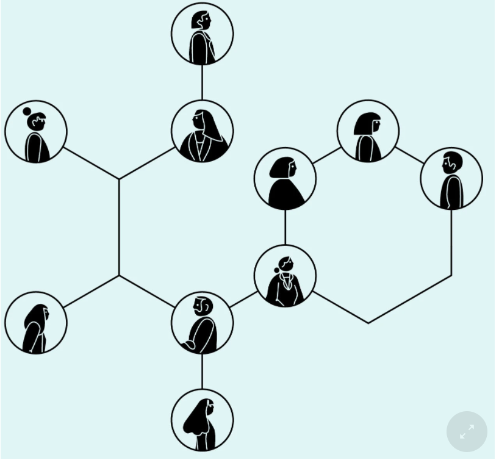
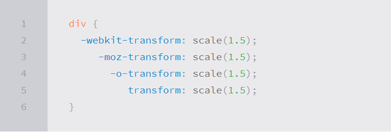

# What Google Learned From Its Quest to Build the Perfect Team
#### Like most 25-year-olds, Julia Rozovsky wasn’t sure what she wanted to do with her life. She had worked at a consulting firm, but it wasn’t a good match. Then she became a researcher for two professors at Harvard, which was interesting but lonely. Maybe a big corporation would be a better fit. Or perhaps a fast-growing start-up. All she knew for certain was that she wanted to find a job that was more social. ‘‘I wanted to be part of a community, part of something people were building together,’’ she told me. She thought about various opportunities — Internet companies, a Ph.D. program — but nothing seemed exactly right. So in 2009, she chose the path that allowed her to put off making a decision: She applied to business schools and was accepted by the Yale School of Management. When Rozovsky arrived on campus, she was assigned to a study group carefully engineered by the school to foster tight bonds. Study groups have become a rite of passage at M.B.A. programs, a way for students to practice working in teams and a reflection of the increasing demand for employees who can adroitly navigate group dynamics. A worker today might start the morning by collaborating with a team of engineers, then send emails to colleagues marketing a new brand, then jump on a conference call planning an entirely different product line, while also juggling team meetings with accounting and the party-planning committee. To prepare students for that complex world, business schools around the country have revised their curriculums to emphasize team-focused learning. 
#### Our data-saturated age enables us to examine our work habits and office quirks with a scrutiny that our cubicle-bound forebears could only dream of. Today, on corporate campuses and within university laboratories, psychologists, sociologists and statisticians are devoting themselves to studying everything from team composition to email patterns in order to figure out how to make employees into faster, better and more productive versions of themselves. ‘‘We’re living through a golden age of understanding personal productivity,’’ says Marshall Van Alstyne, a professor at Boston University who studies how people share information. ‘‘All of a sudden, we can pick apart the small choices that all of us make, decisions most of us don’t even notice, and figure out why some people are so much more effective than everyone else.’’
### THE WORK ISSUE: REIMAGINING THE OFFICE
1. How to Build a Perfect Team
2. The War on Meetings
3. The Case for Blind Hiring
4. Failure to Lunch
5. The 'Good Jobs' Gamble
6. Rethinking the Work-Life Equation
7. The Rise of White-Collar Automation
8. The Post-Cubicle Office
9. The New Dream Jobs
#### Project Aristotle’s researchers began by reviewing a half-century of academic studies looking at how teams worked. Were the best teams made up of people with similar interests? Or did it matter more whether everyone was motivated by the same kinds of rewards? Based on those studies, the researchers scrutinized the composition of groups inside Google: How often did teammates socialize outside the office? Did they have the same hobbies? Were their educational backgrounds similar? Was it better for all teammates to be outgoing or for all of them to be shy? They drew diagrams showing which teams had overlapping memberships and which groups had exceeded their departments’ goals. They studied how long teams stuck together and if gender balance seemed to have an impact on a team’s success.

# Transforms
#### With CSS3 came  new ways to position and alter elements. Now general layout techniques can be revisited with alternative ways to size, position, and change elements. All of these new techniques are made possible by the transform property. The transform property comes in two different settings, two-dimensional and three-dimensional. Each of these come with their own individual properties and values. Within this lesson we’ll take a look at both two-dimensional and three-dimensional transforms. Generally speaking, browser support for the transform property isn’t great, but it is getting better every day. For the best support vendor prefixes are encouraged, however you may need to download the nightly version of Chrome to see all of these transforms in action.
# Transform Syntax
#### The actual syntax for the transform property is quite simple, including the transform property followed by the value. The value specifies the transform type followed by a specific amount inside parentheses.

# 2D Transforms
#### Elements may be distorted, or transformed, on both a two-dimensional plane or a three-dimensional plane. Two-dimensional transforms work on the x and y axes, known as horizontal and vertical axes. Three-dimensional transforms work on both the x and y axes, as well as the z axis. These three-dimensional transforms help define not only the length and width of an element, but also the depth. We’ll start by discussing how to transform elements on a two-dimensional plane, and then work our way into three-dimensional transforms.
1. 2D Rotate
2. 2D Scale
3. 2D Translate
4. 2D Skew

# Combining Transforms
#### It is common for multiple transforms to be used at once, rotating and scaling the size of an element at the same time for example. In this event multiple transforms can be combined together. To combine transforms, list the transform values within the transform property one after the other without the use of commas.
# Transform Origin
#### As previously mentioned, the default transform origin is the dead center of an element, both 50% horizontally and 50% vertically. To change this default origin position the transform-origin property may be used.
# Perspective
#### In order for three-dimensional transforms to work the elements need a perspective from which to transform. The perspective for each element can be thought of as a vanishing point, similar to that which can be seen in three-dimensional drawings. The perspective of an element can be set in two different ways. One way includes using the perspective value within the transform property on individual elements, while the other includes using the perspective property on the parent element residing over child elements being transformed. Using the perspective value within the transform property works great for transforming one element from a single, unique perspective. When you want to transform a group of elements all with the same perspective, or vanishing point, apply the perspective property to their parent element.
1. Perspective Depth Value
2. Perspective Origin
# 3D Transforms
#### Working with two-dimensional transforms we are able to alter elements on the horizontal and vertical axes, however there is another axis along which we can transform elements. Using three-dimensional transforms we can change elements on the z axis, giving us control of depth as well as length and width.
1. 3D Rotate
2. 3D Scale
3. 3D Translate
4. 3D Skew 
5. Shorthand 3D Transforms

# Transform Style
#### The transform-style property needs to be placed on the parent element, above any nested transforms. The preserve-3d value allows the transformed children elements to appear in their own three-dimensional plane while the flat value forces the transformed children elements to lie flat on the two-dimensional plane.
# Transitions & Animations
#### One evolution with CSS3 was the ability to write behaviors for transitions and animations. Front end developers have been asking for the ability to design these interactions within HTML and CSS, without the use of JavaScript or Flash, for years. Now their wish has come true. With CSS3 transitions you have the potential to alter the appearance and behavior of an element whenever a state change occurs, such as when it is hovered over, focused on, active, or targeted. Animations within CSS3 allow the appearance and behavior of an element to be altered in multiple keyframes. Transitions provide a change from one state to another, while animations can set multiple points of transition upon different keyframes.
# Shorthand Transitions
#### Declaring every transition property individually can become quite intensive, especially with vendor prefixes. Fortunately there is a shorthand property, transition, capable of supporting all of these different properties and values. Using the transition value alone, you can set every transition value in the order of transition-property, transition-duration, transition-timing-function, and lastly transition-delay. Do not use commas with these values unless you are identifying numerous transitions.
# Animations
#### Transitions do a great job of building out visual interactions from one state to another, and are perfect for these kinds of single state changes. However, when more control is required, transitions need to have multiple states. In return, this is where animations pick up where transitions leave off.
# Customizing Animations
#### Animations also provide the ability to further customize an element’s behavior, including the ability to declare the number of times an animation runs, as well as the direction in which an animation completes.
# Shorthand Animations
#### Fortunately animations, just like transitions, can be written out in a shorthand format. This is accomplished with one animation property, rather than multiple declarations. The order of values within the animation property should be animation-name, animation-duration, animation-timing-function, animation-delay, animation-iteration-count, animation-direction, animation-fill-mode, and lastly
# 8 SIMPLE CSS3 TRANSITIONS THAT WILL WOW YOUR USERS
1. Fade in
2. Change color
3. Grow & Shrink
4. Rotate elements
5. Square to circle
6. 3D shadow
7. Swing
8. Inset border
