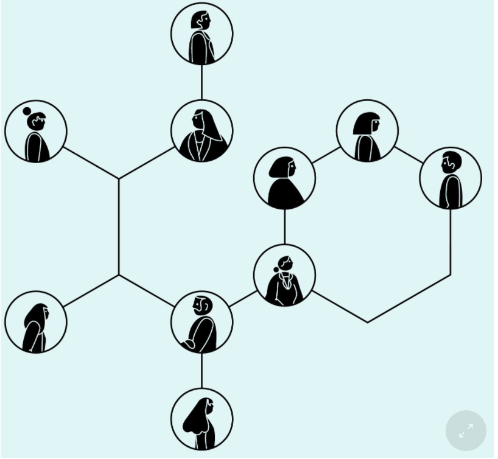

# What Google Learned From Its Quest to Build the Perfect Team
#### Like most 25-year-olds, Julia Rozovsky wasn’t sure what she wanted to do with her life. She had worked at a consulting firm, but it wasn’t a good match. Then she became a researcher for two professors at Harvard, which was interesting but lonely. Maybe a big corporation would be a better fit. Or perhaps a fast-growing start-up. All she knew for certain was that she wanted to find a job that was more social. ‘‘I wanted to be part of a community, part of something people were building together,’’ she told me. She thought about various opportunities — Internet companies, a Ph.D. program — but nothing seemed exactly right. So in 2009, she chose the path that allowed her to put off making a decision: She applied to business schools and was accepted by the Yale School of Management. When Rozovsky arrived on campus, she was assigned to a study group carefully engineered by the school to foster tight bonds. Study groups have become a rite of passage at M.B.A. programs, a way for students to practice working in teams and a reflection of the increasing demand for employees who can adroitly navigate group dynamics. A worker today might start the morning by collaborating with a team of engineers, then send emails to colleagues marketing a new brand, then jump on a conference call planning an entirely different product line, while also juggling team meetings with accounting and the party-planning committee. To prepare students for that complex world, business schools around the country have revised their curriculums to emphasize team-focused learning. 
#### Our data-saturated age enables us to examine our work habits and office quirks with a scrutiny that our cubicle-bound forebears could only dream of. Today, on corporate campuses and within university laboratories, psychologists, sociologists and statisticians are devoting themselves to studying everything from team composition to email patterns in order to figure out how to make employees into faster, better and more productive versions of themselves. ‘‘We’re living through a golden age of understanding personal productivity,’’ says Marshall Van Alstyne, a professor at Boston University who studies how people share information. ‘‘All of a sudden, we can pick apart the small choices that all of us make, decisions most of us don’t even notice, and figure out why some people are so much more effective than everyone else.’’
### THE WORK ISSUE: REIMAGINING THE OFFICE
1. How to Build a Perfect Team
2. The War on Meetings
3. The Case for Blind Hiring
4. Failure to Lunch
5. The 'Good Jobs' Gamble
6. Rethinking the Work-Life Equation
7. The Rise of White-Collar Automation
8. The Post-Cubicle Office
9. The New Dream Jobs
#### Project Aristotle’s researchers began by reviewing a half-century of academic studies looking at how teams worked. Were the best teams made up of people with similar interests? Or did it matter more whether everyone was motivated by the same kinds of rewards? Based on those studies, the researchers scrutinized the composition of groups inside Google: How often did teammates socialize outside the office? Did they have the same hobbies? Were their educational backgrounds similar? Was it better for all teammates to be outgoing or for all of them to be shy? They drew diagrams showing which teams had overlapping memberships and which groups had exceeded their departments’ goals. They studied how long teams stuck together and if gender balance seemed to have an impact on a team’s success.

#### Imagine you have been invited to join one of two groups. Team A is composed of people who are all exceptionally smart and successful. When you watch a video of this group working, you see professionals who wait until a topic arises in which they are expert, and then they speak at length, explaining what the group ought to do. When someone makes a side comment, the speaker stops, reminds everyone of the agenda and pushes the meeting back on track. This team is efficient. There is no idle chitchat or long debates. The meeting ends as scheduled and disbands so everyone can get back to their desks. Team B is different. It’s evenly divided between successful executives and middle managers with few professional accomplishments. Teammates jump in and out of discussions. People interject and complete one another’s thoughts. When a team member abruptly changes the topic, the rest of the group follows him off the agenda. At the end of the meeting, the meeting doesn’t actually end: Everyone sits around to gossip and talk about their lives. Which group would you rather join?

#### In 2008, a group of psychologists from Carnegie Mellon, M.I.T. and Union College began to try to answer a question very much like this one. ‘‘Over the past century, psychologists made considerable progress in defining and systematically measuring intelligence in individuals,’’ the researchers wrote in the journal Science in 2010. ‘‘We have used the statistical approach they developed for individual intelligence to systematically measure the intelligence of groups.’’ Put differently, the researchers wanted to know if there is a collective I. Q. that emerges within a team that is distinct from the smarts of any single member.

#### To accomplish this, the researchers recruited 699 people, divided them into small groups and gave each a series of assignments that required different kinds of cooperation. One assignment, for instance, asked participants to brainstorm possible uses for a brick. Some teams came up with dozens of clever uses; others kept describing the same ideas in different words. Another had the groups plan a shopping trip and gave each teammate a different list of groceries. The only way to maximize the group’s score was for each person to sacrifice an item they really wanted for something the team needed. Some groups easily divvied up the buying; others couldn’t fill their shopping carts because no one was willing to compromise.

#### What interested the researchers most, however, was that teams that did well on one assignment usually did well on all the others. Conversely, teams that failed at one thing seemed to fail at everything. The researchers eventually concluded that what distinguished the ‘‘good’’ teams from the dysfunctional groups was how teammates treated one another. The right norms, in other words, could raise a group’s collective intelligence, whereas the wrong norms could hobble a team, even if, individually, all the members were exceptionally bright.

#### But what was confusing was that not all the good teams appeared to behave in the same ways. ‘‘Some teams had a bunch of smart people who figured out how to break up work evenly,’’ said Anita Woolley, the study’s lead author. ‘‘Other groups had pretty average members, but they came up with ways to take advantage of everyone’s relative strengths. Some groups had one strong leader. Others were more fluid, and everyone took a leadership role.’’

#### As the researchers studied the groups, however, they noticed two behaviors that all the good teams generally shared. First, on the good teams, members spoke in roughly the same proportion, a phenomenon the researchers referred to as ‘‘equality in distribution of conversational turn-taking.’’ On some teams, everyone spoke during each task; on others, leadership shifted among teammates from assignment to assignment. But in each case, by the end of the day, everyone had spoken roughly the same amount. ‘‘As long as everyone got a chance to talk, the team did well,’’ Woolley said. ‘‘But if only one person or a small group spoke all the time, the collective intelligence declined.’’
# In late 2014, Rozovsky and her fellow Project Aristotle number-crunchers began sharing their findings with select groups of Google’s 51,000 employees. By then, they had been collecting surveys, conducting interviews and analyzing statistics for almost three years. They hadn’t yet figured out how to make psychological safety easy, but they hoped that publicizing their research within Google would prompt employees to come up with some ideas of their own.

#### After Rozovsky gave one presentation, a trim, athletic man named Matt Sakaguchi approached the Project Aristotle researchers. Sakaguchi had an unusual background for a Google employee. Twenty years earlier, he was a member of a SWAT team in Walnut Creek, Calif., but left to become an electronics salesman and eventually landed at Google as a midlevel manager, where he has overseen teams of engineers who respond when the company’s websites or servers go down.