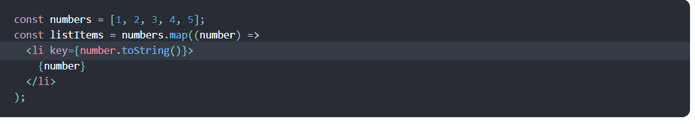
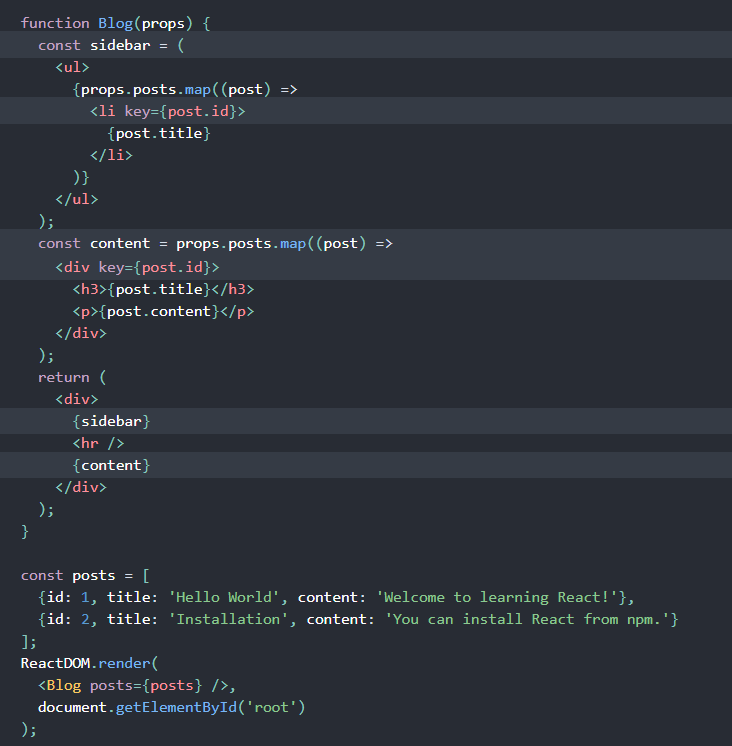

# Lists and Keys
## Basic List Component
#### Usually you would render lists inside a component. We can refactor the previous example into a component that accepts an array of numbers and outputs a list of elements. When you run this code, you’ll be given a warning that a key should be provided for list items. A “key” is a special string attribute you need to include when creating lists of elements. We’ll discuss why it’s important in the next section

## Keys
#### Keys help React identify which items have changed, are added, or are removed. given to the elements inside the array to give the elements a stable identity:

## Extracting Components with Keys
#### Keys only make sense in the context of the surrounding array.
#### For example, if you extract a ListItem component, you should keep the key on the ListItem elements in the array rather than on the li element in the ListItem itself.

## Keys Must Only Be Unique Among Siblings
#### Keys used within arrays should be unique among their siblings. However, they don’t need to be globally unique. We can use the same keys when we produce two different arrays:

# What is the spread operator?
#### InJavaScript, spread syntax refers to the use of an ellipsis of three dots (…) to expand an iterable object into the list of arguments.
#### The spread operator was added to JavaScript in ES6 (ES2015), just like the rest parameters, which have the same syntax: three magic dots
## What is ... used for?
#### Spread operator to the rescue! It looks similar to rest parameters, also using ..., but does quite the opposite.