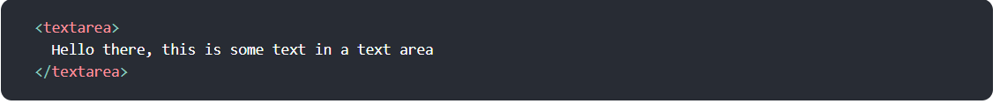
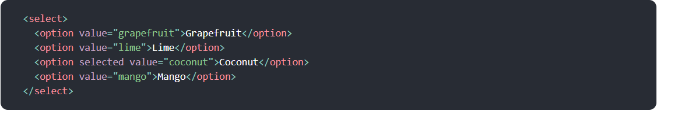
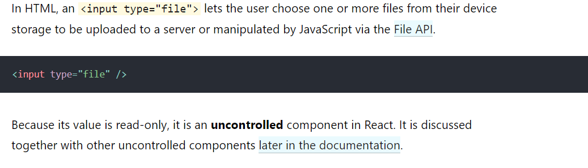

# Forms
#### HTML form elements work a bit differently from other DOM elements in React, because form elements naturally keep some internal state.
## Controlled Components
#### In HTML, form elements such as input, textarea, and select typically maintain their own state and update it based on user input. In React, mutable state is typically kept in the state property of components, and only updated with setState().
#### We can combine the two by making the React state be the “single source of truth”. Then the React component that renders a form also controls what happens in that form on subsequent user input. An input form element whose value is controlled by React in this way is called a “controlled component”
## The textarea Tag

## The select Tag
#### In HTML, select creates a drop-down list. For example, this HTML creates a drop-down list of flavors:

#### Note that the Coconut option is initially selected, because of the selected attribute. React, instead of using this selected attribute, uses a value attribute on the root select tag.
## The file input Tag

## Handling Multiple Inputs
#### When you need to handle multiple controlled input elements, you can add a name attribute to each element and let the handler function choose what to do based on the value of event.target.name.
## Controlled Input Null Value
#### Specifying the value prop on a controlled component prevents the user from changing the input unless you desire so. If you’ve specified a value but the input is still editable, you may have accidentally set value to undefined or null.
## Alternatives to Controlled Components
#### It can sometimes be tedious to use controlled components, because you need to write an event handler for every way your data can change and pipe all of the input state through a React component. This can become particularly annoying when you are converting a preexisting codebase to React, or integrating a React application with a non-React library. In these situations, you might want to check out uncontrolled components, an alternative technique for implementing input forms.
## Fully-Fledged Solutions
#### If you’re looking for a complete solution including validation, keeping track of the visited fields, and handling form submission, Formik is one of the popular choices. However, it is built on the same principles of controlled components and managing state — so don’t neglect to learn them.