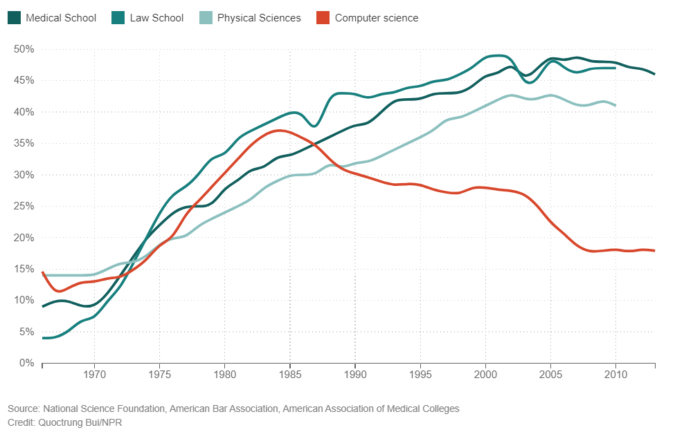

# When Women Stopped Coding
1. What occured during the same time as the beginning of the decline of women in computer sciene?
2. Why does it matter that males had been playing on computers growing up?
## What Happened To Women In Computer Science?

### What happened?
#### We spent the past few weeks trying to answer this question, and there's no clear, single answer.

#### But here's a good starting place: The share of women in computer science started falling at roughly the same moment when personal computers started showing up in U.S. homes in significant numbers.
#### These early personal computers weren't much more than toys. You could play pong or simple shooting games, maybe do some word processing. And these toys were marketed almost entirely to men and boys.
#### This idea that computers are for boys became a narrative. It became the story we told ourselves about the computing revolution. It helped define who geeks were, and it created techie culture.
#### Movies like Weird Science, Revenge of the Nerds and War Games all came out in the '80s. And the plot summaries are almost interchangeable: awkward geek boy genius uses tech savvy to triumph over adversity and win the girl.

#### In the 1990s, researcher Jane Margolis interviewed hundreds of computer science students at Carnegie Mellon University, which had one of the top programs in the country. She found that families were much more likely to buy computers for boys than for girls — even when their girls were really interested in computers.

#### This was a big deal when those kids got to college. As personal computers became more common, computer science professors increasingly assumed that their students had grown up playing with computers at home.

3. What three take-a-ways do you have looking at this data?
- Entity 
- GENDER
- ETHNICITY

4. When are diversity efforts most successful?
5. Why do diverse companies perform better?
6. Give an example of how a diverse company can serve a diverse user base or vise-versa.

## Why diversity matters to your tech company?
#### Diversity efforts are most successful when they’re driven by a commitment from company leaders. And meaningful commitment requires leaders to understand why diversity matters. At Paradigm, we spend a lot of time brainstorming with CEOs and other company leaders about what is or should be driving their diversity and inclusion efforts. Here are five themes that have emerged from those conversations: 
- Diverse teams are smarter and more creative 
- Diverse companies can better serve a diverse user base 